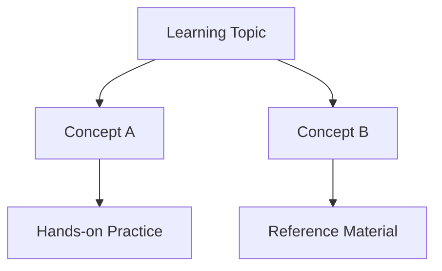

# Concepts

## Core Ideas

Document the important concepts in plain language.

## Relationships

Use this section for diagrams, ownership boundaries, and system interactions.

```mermaid
graph TD
  Topic[Learning Topic] --> ConceptA[Concept A]
  Topic --> ConceptB[Concept B]
  ConceptA --> Practice[Hands-on Practice]
  ConceptB --> Reference[Reference Material]
```
